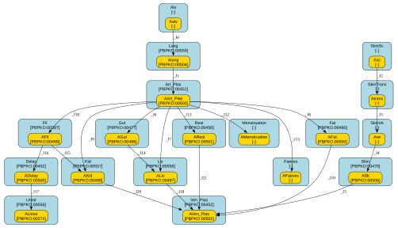

# PBK_PFAS_Recetox_2026

## Creators

*not specified*

## Overview

| key                          | value                           |
|:-----------------------------|:--------------------------------|
| Modelled species/orgamism(s) | *not specified*                 |
| Model chemical(s)            | *not specified*                 |
| Input route(s)               | 3 (inhalation, dermal, oral)    |
| Time resolution              | d                               |
| Amounts unit                 | ug                              |
| Volume unit                  | L                               |
| Number of compartments       | 18                              |
| Number of species            | 18                              |
| Number of parameters         | 118 (58 external / 60 internal) |

## Diagram

## Compartments

| id           | name                         | unit            | model qualifier                            |
|:-------------|:-----------------------------|:----------------|:-------------------------------------------|
| Alv          | *not specified*              | *not specified* | *not specified*                            |
| Lung         | lung                         | L               | http://purl.obolibrary.org/obo/PBPKO_00559 |
| SkinSc       | *not specified*              | *not specified* | *not specified*                            |
| SkinTrans    | *not specified*              | *not specified* | *not specified*                            |
| SkinVe       | *not specified*              | *not specified* | *not specified*                            |
| Skin         | skin                         | L               | http://purl.obolibrary.org/obo/PBPKO_00470 |
| Ven_Plas     | venous blood                 | L               | http://purl.obolibrary.org/obo/PBPKO_00452 |
| Art_Plas     | arterial blood               | L               | http://purl.obolibrary.org/obo/PBPKO_00451 |
| Gut          | gut                          | L               | http://purl.obolibrary.org/obo/PBPKO_00477 |
| Liv          | liver                        | L               | http://purl.obolibrary.org/obo/PBPKO_00558 |
| Fat          | adipose tissue               | L               | http://purl.obolibrary.org/obo/PBPKO_00460 |
| Kid          | kidney                       | L               | http://purl.obolibrary.org/obo/PBPKO_00557 |
| Fil          | filtrate                     | L               | http://purl.obolibrary.org/obo/PBPKO_00397 |
| Rest         | rest-of-body                 | L               | http://purl.obolibrary.org/obo/PBPKO_00450 |
| Delay        | storage compartment of urine | L               | http://purl.obolibrary.org/obo/PBPKO_00402 |
| Urine        | urine                        | L               | http://purl.obolibrary.org/obo/PBPKO_00556 |
| Menstruation | *not specified*              | *not specified* | *not specified*                            |
| Faeces       | *not specified*              | *not specified* | *not specified*                            |

## Species

| id            | name                              | unit            | model qualifier                            |
|:--------------|:----------------------------------|:----------------|:-------------------------------------------|
| Aalv          | *not specified*                   | *not specified* | *not specified*                            |
| Alung         | quantity in lung                  | ug              | http://purl.obolibrary.org/obo/PBPKO_00504 |
| Asc           | *not specified*                   | *not specified* | *not specified*                            |
| Atrans        | *not specified*                   | *not specified* | *not specified*                            |
| Ave           | *not specified*                   | *not specified* | *not specified*                            |
| ASk           | quantity in skin                  | ug              | http://purl.obolibrary.org/obo/PBPKO_00506 |
| AVen_Plas     | quantity in venous blood plasma   | ug              | http://purl.obolibrary.org/obo/PBPKO_00502 |
| AArt_Plas     | quantity in arterial blood plasma | ug              | http://purl.obolibrary.org/obo/PBPKO_00502 |
| AGut          | quantity in gut                   | ug              | http://purl.obolibrary.org/obo/PBPKO_00496 |
| ALiv          | quantity in liver                 | ug              | http://purl.obolibrary.org/obo/PBPKO_00497 |
| AFat          | quantity in fat                   | ug              | http://purl.obolibrary.org/obo/PBPKO_00550 |
| AKid          | quantity in kidney                | ug              | http://purl.obolibrary.org/obo/PBPKO_00498 |
| AFil          | quantity in filtrate              | ug              | http://purl.obolibrary.org/obo/PBPKO_00499 |
| ADelay        | quantity in delay                 | ug              | http://purl.obolibrary.org/obo/PBPKO_00500 |
| AUrine        | quantity in urine                 | ug              | http://purl.obolibrary.org/obo/PBPKO_00274 |
| ARest         | quantity in rest-of-body          | ug              | http://purl.obolibrary.org/obo/PBPKO_00501 |
| AMenstruation | *not specified*                   | *not specified* | *not specified*                            |
| AFaeces       | *not specified*                   | *not specified* | *not specified*                            |

## Transfer equations

| id   | from      | to            | equation                                                                                 |
|:-----|:----------|:--------------|:-----------------------------------------------------------------------------------------|
| _J0  | Aalv      | Alung         | Qp * Pab * (Aalv / Alv)                                                                  |
| _J1  | Alung     | AArt_Plas     | QCP * Free * (Alung / Lung)                                                              |
| _J2  | Asc       | Atrans        | 2 * CLsc * (Asc / Vsc)                                                                   |
| _J3  | Atrans    | Ave           | 2 * CLsc * (Asc / Vsc) - 2 * CLve * (Atrans / Vsc) / Kscve + 2 * CLve * (Ave / Vve)      |
| _J4  | Ave       | ASk           | 2 * CLve * (Atrans / Vsc) / Kscve - 2 * CLve * (Ave / Vve) - CLcell * (Ave / Vve) / Kver |
| _J5  | ASk       | AVen_Plas     | CLcell * (Ave / Vve) / Kver + QSk * FreeSk * (ASk / Skin)                                |
| _J6  | AArt_Plas | AGut          | QG * Free * (AArt_Plas / Art_Plas)                                                       |
| _J7  | AArt_Plas | ALiv          | QL * Free * (AArt_Plas / Art_Plas)                                                       |
| _J8  | AArt_Plas | AFat          | QF * Free * (AArt_Plas / Art_Plas)                                                       |
| _J9  | AArt_Plas | AKid          | QK * Free * (AArt_Plas / Art_Plas)                                                       |
| _J10 | AArt_Plas | AFil          | Qfil * Free * (AArt_Plas / Art_Plas)                                                     |
| _J11 | AArt_Plas | ARest         | QR * Free * (AArt_Plas / Art_Plas)                                                       |
| _J12 | AArt_Plas | AMenstruation | CLmenstruation * Free * (AArt_Plas / Art_Plas)                                           |
| _J13 | AArt_Plas | AFaeces       | CLfaeces * Free * (AArt_Plas / Art_Plas)                                                 |
| _J14 | AGut      | ALiv          | QG * FreeG * (AGut / Gut)                                                                |
| _J15 | AFil      | AKid          | Tm * (AFil / Fil) / (Kt + AFil / Fil)                                                    |
| _J16 | AFil      | ADelay        | Qfil * (AFil / Fil)                                                                      |
| _J17 | ADelay    | AUrine        | kurine * ADelay                                                                          |
| _J18 | ALiv      | AVen_Plas     | (QL + QG) * FreeL * (ALiv / Liv)                                                         |
| _J19 | AFat      | AVen_Plas     | QF * FreeF * (AFat / Fat)                                                                |
| _J20 | AKid      | AVen_Plas     | QK * FreeK * (AKid / Kid)                                                                |
| _J21 | ARest     | AVen_Plas     | QR * FreeR * (ARest / Rest)                                                              |

## ODEs

| species       | equation                                                                                                                                                                                                                                                                                                                                                                                                                                                                                                          |
|:--------------|:------------------------------------------------------------------------------------------------------------------------------------------------------------------------------------------------------------------------------------------------------------------------------------------------------------------------------------------------------------------------------------------------------------------------------------------------------------------------------------------------------------------|
| Aalv          | d[Aalv]/dt = - Qp * Pab * (Aalv / Alv)                                                                                                                                                                                                                                                                                                                                                                                                                                                                            |
| Alung         | d[Alung]/dt = Qp * Pab * (Aalv / Alv)              - QCP * Free * (Alung / Lung)                                                                                                                                                                                                                                                                                                                                                                                                                                  |
| Asc           | d[Asc]/dt = - 2 * CLsc * (Asc / Vsc)                                                                                                                                                                                                                                                                                                                                                                                                                                                                              |
| Atrans        | d[Atrans]/dt = 2 * CLsc * (Asc / Vsc)               - 2 * CLsc * (Asc / Vsc) - 2 * CLve * (Atrans / Vsc) / Kscve + 2 * CLve * (Ave / Vve)                                                                                                                                                                                                                                                                                                                                                                         |
| Ave           | d[Ave]/dt = 2 * CLsc * (Asc / Vsc) - 2 * CLve * (Atrans / Vsc) / Kscve + 2 * CLve * (Ave / Vve)            - 2 * CLve * (Atrans / Vsc) / Kscve - 2 * CLve * (Ave / Vve) - CLcell * (Ave / Vve) / Kver                                                                                                                                                                                                                                                                                                             |
| ASk           | d[ASk]/dt = 2 * CLve * (Atrans / Vsc) / Kscve - 2 * CLve * (Ave / Vve) - CLcell * (Ave / Vve) / Kver            - CLcell * (Ave / Vve) / Kver + QSk * FreeSk * (ASk / Skin)                                                                                                                                                                                                                                                                                                                                       |
| AVen_Plas     | d[AVen_Plas]/dt = CLcell * (Ave / Vve) / Kver + QSk * FreeSk * (ASk / Skin)                  + (QL + QG) * FreeL * (ALiv / Liv)                  + QF * FreeF * (AFat / Fat)                  + QK * FreeK * (AKid / Kid)                  + QR * FreeR * (ARest / Rest)                                                                                                                                                                                                                                          |
| AArt_Plas     | d[AArt_Plas]/dt = QCP * Free * (Alung / Lung)                  - QG * Free * (AArt_Plas / Art_Plas)                  - QL * Free * (AArt_Plas / Art_Plas)                  - QF * Free * (AArt_Plas / Art_Plas)                  - QK * Free * (AArt_Plas / Art_Plas)                  - Qfil * Free * (AArt_Plas / Art_Plas)                  - QR * Free * (AArt_Plas / Art_Plas)                  - CLmenstruation * Free * (AArt_Plas / Art_Plas)                  - CLfaeces * Free * (AArt_Plas / Art_Plas) |
| AGut          | d[AGut]/dt = QG * Free * (AArt_Plas / Art_Plas)             - QG * FreeG * (AGut / Gut)                                                                                                                                                                                                                                                                                                                                                                                                                           |
| ALiv          | d[ALiv]/dt = QL * Free * (AArt_Plas / Art_Plas)             + QG * FreeG * (AGut / Gut)             - (QL + QG) * FreeL * (ALiv / Liv)                                                                                                                                                                                                                                                                                                                                                                            |
| AFat          | d[AFat]/dt = QF * Free * (AArt_Plas / Art_Plas)             - QF * FreeF * (AFat / Fat)                                                                                                                                                                                                                                                                                                                                                                                                                           |
| AKid          | d[AKid]/dt = QK * Free * (AArt_Plas / Art_Plas)             + Tm * (AFil / Fil) / (Kt + AFil / Fil)             - QK * FreeK * (AKid / Kid)                                                                                                                                                                                                                                                                                                                                                                       |
| AFil          | d[AFil]/dt = Qfil * Free * (AArt_Plas / Art_Plas)             - Tm * (AFil / Fil) / (Kt + AFil / Fil)             - Qfil * (AFil / Fil)                                                                                                                                                                                                                                                                                                                                                                           |
| ADelay        | d[ADelay]/dt = Qfil * (AFil / Fil)               - kurine * ADelay                                                                                                                                                                                                                                                                                                                                                                                                                                                |
| AUrine        | d[AUrine]/dt = kurine * ADelay                                                                                                                                                                                                                                                                                                                                                                                                                                                                                    |
| ARest         | d[ARest]/dt = QR * Free * (AArt_Plas / Art_Plas)              - QR * FreeR * (ARest / Rest)                                                                                                                                                                                                                                                                                                                                                                                                                       |
| AMenstruation | d[AMenstruation]/dt = CLmenstruation * Free * (AArt_Plas / Art_Plas)                                                                                                                                                                                                                                                                                                                                                                                                                                              |
| AFaeces       | d[AFaeces]/dt = CLfaeces * Free * (AArt_Plas / Art_Plas)                                                                                                                                                                                                                                                                                                                                                                                                                                                          |

## Rate rules

| variable   | rule              |
|:-----------|:------------------|
| Age        | dAge/dt = 1 / 365 |

## Assignment rules

| variable          | assignment                                                                                                                                         |
|:------------------|:---------------------------------------------------------------------------------------------------------------------------------------------------|
| Alv               | 0.03 * BW                                                                                                                                          |
| Lung              | VLun                                                                                                                                               |
| SkinSc            | Vsc                                                                                                                                                |
| SkinTrans         | 1                                                                                                                                                  |
| SkinVe            | Vve                                                                                                                                                |
| Skin              | VSk                                                                                                                                                |
| Ven_Plas          | VvenC * VPlasC * BW                                                                                                                                |
| Art_Plas          | VartC * VPlasC * BW                                                                                                                                |
| Gut               | VInt                                                                                                                                               |
| Liv               | VL                                                                                                                                                 |
| Fat               | VAdi                                                                                                                                               |
| Kid               | VK                                                                                                                                                 |
| Fil               | VK * 0.1                                                                                                                                           |
| Rest              | FBW * BW - VLun - VK - VInt - VL - VSk - VAdi - VK * 0.1 - VPlasC * BW                                                                             |
| deltaBW           | BWRef / f_BW(AgeRef, BWBirth)                                                                                                                      |
| BW                | deltaBW * f_BW(Age, BWBirth)                                                                                                                       |
| mB                | piecewise((3.33 * BSA - 0.81) * SDB, eq(Sex, 0), (2.66 * BSA - 0.46) * SDB)                                                                        |
| BSA               | 0.007184 * pow(BW, 0.425) * pow(100 * Height, 0.725)                                                                                               |
| BMI               | BW / pow(Height, 2)                                                                                                                                |
| EDV               | 43.13 + 12.96 * mB                                                                                                                                 |
| EF                | 0.65 - 0.0018 * BMI                                                                                                                                |
| mAdi_male_0_1     | (0.9084 + 0.706 * BW + 5.3 * Height - 3.057 * 0.365 * Age) / 100 * BW                                                                              |
| mAdi_female_0_1   | (0.9084 + 0.706 * BW + 5.3 * Height + 0.3585 - 3.057 * 0.365 * Age) / 100 * BW                                                                     |
| mAdi_male_4_15    | (1.51 * BMI - 0.7 * Age - 3.6 + 1.4) / 100 * BW                                                                                                    |
| mAdi_female_4_15  | (1.51 * BMI - 0.7 * Age + 1.4) / 100 * BW                                                                                                          |
| mAdi_male_18_99   | (1.2 * BMI + 0.23 * Age - 10.8 - 5.4) / 100 * BW                                                                                                   |
| mAdi_female_18_99 | (1.2 * BMI + 0.23 * Age - 5.4) / 100 * BW                                                                                                          |
| mAdi_0_1          | piecewise(mAdi_male_0_1, eq(Sex, 0), mAdi_female_0_1)                                                                                              |
| mAdi_4_15         | piecewise(mAdi_male_4_15, eq(Sex, 0), mAdi_female_4_15)                                                                                            |
| mAdi_18_99        | piecewise(mAdi_male_18_99, eq(Sex, 0), mAdi_female_18_99)                                                                                          |
| mAdi              | piecewise(mAdi_0_1 * SDAdi, lt(Age, 1), piecewise(mAdi_4_15 * SDAdi, lt(Age, 15), piecewise(mAdi_18_99 * SDAdi, lt(Age, 99), mAdi_18_99 * SDAdi))) |
| mLun              | exp(2.1 * log(Height) - 2.092) * SDLun                                                                                                             |
| mK                | exp(1.93 * log(Height) - 2.306) * SDK                                                                                                              |
| mInt              | exp(2.47 * log(Height) - 1.351) * SDInt                                                                                                            |
| mL                | exp(1.98 * log(Height) - 0.6786) * SDL                                                                                                             |
| mSk               | exp(1.64 * BSA - 1.93) * SDSk                                                                                                                      |
| VLun              | mLun / rhoLun                                                                                                                                      |
| VK                | mK / rhoK                                                                                                                                          |
| VInt              | mInt / rhoInt                                                                                                                                      |
| VL                | mL / rhoL                                                                                                                                          |
| VSk               | mSk / rhoSk                                                                                                                                        |
| VB                | mB / rhoB                                                                                                                                          |
| VAdi              | mAdi / rhoAdi                                                                                                                                      |
| Tm                | Tmc * pow(BW, 0.75)                                                                                                                                |
| FreeL             | Free / PL                                                                                                                                          |
| FreeF             | Free / PF                                                                                                                                          |
| FreeK             | Free / PK                                                                                                                                          |
| FreeSk            | Free / PSk                                                                                                                                         |
| FreeR             | Free / PR                                                                                                                                          |
| FreeG             | Free / PG                                                                                                                                          |
| FreeLun           | Free / PLun                                                                                                                                        |
| QC                | HR * EDV * EF / 1000 * 60 * 24                                                                                                                     |
| QCP               | QC * (1 - Htc)                                                                                                                                     |
| QL                | (25.53 + 1.3 * Sex) / 100 * QCP                                                                                                                    |
| QF                | exp(2.5 - 0.043 * BMI + 0.033 * mAdi) / 100 * QCP                                                                                                  |
| QK                | (20.57 - 1.76 * Sex) / 100 * QCP                                                                                                                   |
| Qfil              | QfilC * QK                                                                                                                                         |
| QG                | (18.52 + 3.04 * Sex - (0.2 + 0.06 * Sex) * BMI + (0.0009 + 0.0004 * Sex) * pow(BMI, 2)) / 100 * QCP                                                |
| QSk               | (5.68 - 0.034 * BMI) / 100 * QCP                                                                                                                   |
| QR                | QCP - QL - QF - QK - QG - QSk                                                                                                                      |
| Qp                | ((1400 - 190) * pow(Age, 2.5) / (pow(Age, 2.5) + 50) + 190) * 24                                                                                   |
| Pab               | 1 / pow(10, 6.96 - 1.04 * log10(VP) - 0.533 * logP - 0.00495 * MW)                                                                                 |
| Kscve             | (1 - ffatve + ffatve * pow(10, logP)) / (1 - ffatsc + ffatsc * pow(10, logP))                                                                      |
| Kver              | (1 - ffatbl + ffatbl * pow(10, logP)) / (1 - ffatepi + ffatepi * pow(10, logP))                                                                    |
| SkinArea          | fss * BSA                                                                                                                                          |
| Vsc               | SkinArea * hsc / 1000                                                                                                                              |
| Vve               | SkinArea * hve / 1000                                                                                                                              |
| CLcell            | 24 * Kpcell * fss * BSA / 1000                                                                                                                     |
| CLsc              | 24 * Kpsc * fss * BSA / 1000                                                                                                                       |
| CLve              | 24 * Kpve * fss * BSA / 1000                                                                                                                       |
| CLmenstruation    | piecewise(MFV * 0.5 * (1 - Htc) + MFV * 0.5, and(eq(Sex, 1), geq(Age, age_start_menstruation), leq(Age, age_stop_menstruation)), 0)                |
| CLfaeces          | CLfaecesc * BW                                                                                                                                     |
| kurine            | kurinec * pow(BW, -0.25)                                                                                                                           |

## Function definitions

| function   | definition                                                                                                       |
|:-----------|:-----------------------------------------------------------------------------------------------------------------|
| f_BW       | f_BW(age, BW_birth) = lambda(age, BW_birth, BW_birth + 4.47 * age - 0.093 * pow(age, 2) + 0.00061 * pow(age, 3)) |

## Parameters

| id                     | name                                                                                    | unit            | model qualifier                            |
|:-----------------------|:----------------------------------------------------------------------------------------|:----------------|:-------------------------------------------|
| AgeRef                 | current age of reference indvididual in simulation                                      | y               | *not specified*                            |
| Age                    | age during simulation                                                                   | y               | http://purl.obolibrary.org/obo/PBPKO_00521 |
| Sex                    | *not specified*                                                                         | *not specified* | *not specified*                            |
| BWRef                  | body weight of reference indvididual in simulation                                      | kg              | *not specified*                            |
| BWBirth                | population nominal body weight at birth                                                 | kg              | *not specified*                            |
| Height                 | *not specified*                                                                         | *not specified* | *not specified*                            |
| deltaBW                | relative body weight of reference individual compared to population nominal body weight | dimensionless   | *not specified*                            |
| BW                     | body weight                                                                             | kg              | http://purl.obolibrary.org/obo/PBPKO_00008 |
| SDB                    | *not specified*                                                                         | *not specified* | *not specified*                            |
| SDAdi                  | *not specified*                                                                         | *not specified* | *not specified*                            |
| mB                     | *not specified*                                                                         | *not specified* | *not specified*                            |
| BSA                    | total area of the skin                                                                  | cm^2            | http://purl.obolibrary.org/obo/PBPKO_00010 |
| BMI                    | *not specified*                                                                         | *not specified* | *not specified*                            |
| HR                     | *not specified*                                                                         | *not specified* | *not specified*                            |
| EDV                    | *not specified*                                                                         | *not specified* | *not specified*                            |
| EF                     | *not specified*                                                                         | *not specified* | *not specified*                            |
| SDLun                  | *not specified*                                                                         | *not specified* | *not specified*                            |
| SDK                    | *not specified*                                                                         | *not specified* | *not specified*                            |
| SDInt                  | *not specified*                                                                         | *not specified* | *not specified*                            |
| SDL                    | *not specified*                                                                         | *not specified* | *not specified*                            |
| SDSk                   | *not specified*                                                                         | *not specified* | *not specified*                            |
| mAdi_male_0_1          | *not specified*                                                                         | *not specified* | *not specified*                            |
| mAdi_female_0_1        | *not specified*                                                                         | *not specified* | *not specified*                            |
| mAdi_male_4_15         | *not specified*                                                                         | *not specified* | *not specified*                            |
| mAdi_female_4_15       | *not specified*                                                                         | *not specified* | *not specified*                            |
| mAdi_male_18_99        | *not specified*                                                                         | *not specified* | *not specified*                            |
| mAdi_female_18_99      | *not specified*                                                                         | *not specified* | *not specified*                            |
| mAdi_0_1               | *not specified*                                                                         | *not specified* | *not specified*                            |
| mAdi_4_15              | *not specified*                                                                         | *not specified* | *not specified*                            |
| mAdi_18_99             | *not specified*                                                                         | *not specified* | *not specified*                            |
| mAdi                   | *not specified*                                                                         | *not specified* | *not specified*                            |
| mLun                   | *not specified*                                                                         | *not specified* | *not specified*                            |
| mK                     | *not specified*                                                                         | *not specified* | *not specified*                            |
| mInt                   | *not specified*                                                                         | *not specified* | *not specified*                            |
| mL                     | *not specified*                                                                         | *not specified* | *not specified*                            |
| mSk                    | *not specified*                                                                         | *not specified* | *not specified*                            |
| rhoLun                 | *not specified*                                                                         | *not specified* | *not specified*                            |
| rhoK                   | *not specified*                                                                         | *not specified* | *not specified*                            |
| rhoInt                 | *not specified*                                                                         | *not specified* | *not specified*                            |
| rhoL                   | *not specified*                                                                         | *not specified* | *not specified*                            |
| rhoSk                  | *not specified*                                                                         | *not specified* | *not specified*                            |
| rhoB                   | *not specified*                                                                         | *not specified* | *not specified*                            |
| rhoAdi                 | *not specified*                                                                         | *not specified* | *not specified*                            |
| FBW                    | Fraction of the BW covered by the sum of the compartments                               | L/kg            | *not specified*                            |
| VPlasC                 | fraction plasma volume                                                                  | L/kg            | http://purl.obolibrary.org/obo/PBPKO_00104 |
| VartC                  | fraction arterial plasma volume                                                         | dimensionless   | *not specified*                            |
| VvenC                  | fraction venous plasma volume                                                           | dimensionless   | *not specified*                            |
| Htc                    | hematocrit                                                                              | dimensionless   | *not specified*                            |
| VLun                   | *not specified*                                                                         | *not specified* | *not specified*                            |
| VK                     | *not specified*                                                                         | *not specified* | *not specified*                            |
| VInt                   | *not specified*                                                                         | *not specified* | *not specified*                            |
| VL                     | *not specified*                                                                         | *not specified* | *not specified*                            |
| VSk                    | *not specified*                                                                         | *not specified* | *not specified*                            |
| VB                     | *not specified*                                                                         | *not specified* | *not specified*                            |
| VAdi                   | *not specified*                                                                         | *not specified* | *not specified*                            |
| QfilC                  | fraction of kidney plasma flow to filtrate                                              | dimensionless   | http://purl.obolibrary.org/obo/PBPKO_00511 |
| SkinThickness          | skin thickness                                                                          | cm              | *not specified*                            |
| FSkinExposed           | fraction of skin exposed                                                                | dimensionless   | http://purl.obolibrary.org/obo/PBPKO_00061 |
| fss                    | *not specified*                                                                         | *not specified* | *not specified*                            |
| hsc                    | *not specified*                                                                         | *not specified* | *not specified*                            |
| hve                    | *not specified*                                                                         | *not specified* | *not specified*                            |
| Kpcell                 | *not specified*                                                                         | *not specified* | *not specified*                            |
| ffatsc                 | *not specified*                                                                         | *not specified* | *not specified*                            |
| ffatve                 | *not specified*                                                                         | *not specified* | *not specified*                            |
| ffatepi                | *not specified*                                                                         | *not specified* | *not specified*                            |
| ffatbl                 | *not specified*                                                                         | *not specified* | *not specified*                            |
| Kpsc                   | *not specified*                                                                         | *not specified* | *not specified*                            |
| Kpve                   | *not specified*                                                                         | *not specified* | *not specified*                            |
| MW                     | molar weight                                                                            | g/mol           | http://purl.obolibrary.org/obo/PBPKO_00127 |
| logP                   | logP                                                                                    | dimensionless   | http://purl.obolibrary.org/obo/PBPKO_00131 |
| VP                     | vapor pressure                                                                          | kg/m/s^2        | *not specified*                            |
| Tmc                    | maximum resorption rate                                                                 | ug/d/kg^0.75    | http://purl.obolibrary.org/obo/PBPKO_00535 |
| Kt                     | resorption affinity                                                                     | ug/L            | http://purl.obolibrary.org/obo/PBPKO_00536 |
| Free                   | free fraction in plasma                                                                 | dimensionless   | http://purl.obolibrary.org/obo/PBPKO_00591 |
| PL                     | partition coefficient liver/plasma                                                      | dimensionless   | http://purl.obolibrary.org/obo/PBPKO_00170 |
| PF                     | partition coefficient fat/plasma                                                        | dimensionless   | http://purl.obolibrary.org/obo/PBPKO_00174 |
| PK                     | partition coefficient kidney/plasma                                                     | dimensionless   | http://purl.obolibrary.org/obo/PBPKO_00171 |
| PSk                    | partition coefficient skin/plasma                                                       | dimensionless   | http://purl.obolibrary.org/obo/PBPKO_00176 |
| PR                     | partition coefficient rest-of-body/plasma                                               | dimensionless   | http://purl.obolibrary.org/obo/PBPKO_00518 |
| PG                     | partition coefficient gut/plasma                                                        | dimensionless   | http://purl.obolibrary.org/obo/PBPKO_00166 |
| PLun                   | partition coefficient lung/plasma                                                       | dimensionless   | http://purl.obolibrary.org/obo/PBPKO_00179 |
| PT                     | *not specified*                                                                         | *not specified* | *not specified*                            |
| Ratio                  | *not specified*                                                                         | *not specified* | *not specified*                            |
| MFV                    | *not specified*                                                                         | *not specified* | *not specified*                            |
| age_start_menstruation | *not specified*                                                                         | *not specified* | *not specified*                            |
| age_stop_menstruation  | *not specified*                                                                         | *not specified* | *not specified*                            |
| Tm                     | transporter maximum                                                                     | ug/d            | http://purl.obolibrary.org/obo/PBPKO_00535 |
| FreeL                  | free fraction of chemical in liver                                                      | dimensionless   | http://purl.obolibrary.org/obo/PBPKO_00154 |
| FreeF                  | free fraction of chemical in fat                                                        | dimensionless   | http://purl.obolibrary.org/obo/PBPKO_00158 |
| FreeK                  | free fraction of chemical in kidney                                                     | dimensionless   | http://purl.obolibrary.org/obo/PBPKO_00155 |
| FreeSk                 | free fraction of chemical in skin                                                       | dimensionless   | http://purl.obolibrary.org/obo/PBPKO_00160 |
| FreeR                  | free fraction of chemical in rest of body                                               | dimensionless   | *not specified*                            |
| FreeG                  | free fraction of chemical in gut                                                        | dimensionless   | http://purl.obolibrary.org/obo/PBPKO_00150 |
| FreeLun                | free fraction of chemical in lung                                                       | dimensionless   | http://purl.obolibrary.org/obo/PBPKO_00163 |
| QC                     | cardiac output adjusted for body weight                                                 | L/d             | http://purl.obolibrary.org/obo/PBPKO_00013 |
| QCP                    | cardiac output adjusted for plasma flow                                                 | L/d             | http://purl.obolibrary.org/obo/PBPKO_00528 |
| QL                     | scaled plasma flow to liver                                                             | L/d             | http://purl.obolibrary.org/obo/PBPKO_00024 |
| QF                     | scaled plasma flow to fat                                                               | L/d             | http://purl.obolibrary.org/obo/PBPKO_00032 |
| QK                     | scaled plasma flow to kidney                                                            | L/d             | http://purl.obolibrary.org/obo/PBPKO_00026 |
| Qfil                   | plasma flow to filtrate compartment                                                     | L/d             | http://purl.obolibrary.org/obo/PBPKO_00529 |
| QG                     | scaled plasma flow to gut                                                               | L/d             | http://purl.obolibrary.org/obo/PBPKO_00531 |
| QSk                    | scaled plasma flow to the skin                                                          | L/d             | http://purl.obolibrary.org/obo/PBPKO_00036 |
| QR                     | plasma flow to the rest of the body                                                     | L/d             | http://purl.obolibrary.org/obo/PBPKO_00050 |
| Qp                     | *not specified*                                                                         | *not specified* | *not specified*                            |
| Pab                    | *not specified*                                                                         | *not specified* | *not specified*                            |
| Kscve                  | *not specified*                                                                         | *not specified* | *not specified*                            |
| Kver                   | *not specified*                                                                         | *not specified* | *not specified*                            |
| SkinArea               | *not specified*                                                                         | *not specified* | *not specified*                            |
| Vsc                    | *not specified*                                                                         | *not specified* | *not specified*                            |
| Vve                    | *not specified*                                                                         | *not specified* | *not specified*                            |
| CLcell                 | *not specified*                                                                         | *not specified* | *not specified*                            |
| CLsc                   | *not specified*                                                                         | *not specified* | *not specified*                            |
| CLve                   | *not specified*                                                                         | *not specified* | *not specified*                            |
| CLmenstruation         | *not specified*                                                                         | *not specified* | *not specified*                            |
| CLfaecesc              | *not specified*                                                                         | *not specified* | *not specified*                            |
| CLfaeces               | *not specified*                                                                         | *not specified* | *not specified*                            |
| kurinec                | urinary elimination rate constant                                                       | /d.kg^0.25      | http://purl.obolibrary.org/obo/PBPKO_00520 |
| kurine                 | urinary elimination rate constant                                                       | /d              | http://purl.obolibrary.org/obo/PBPKO_00520 |

